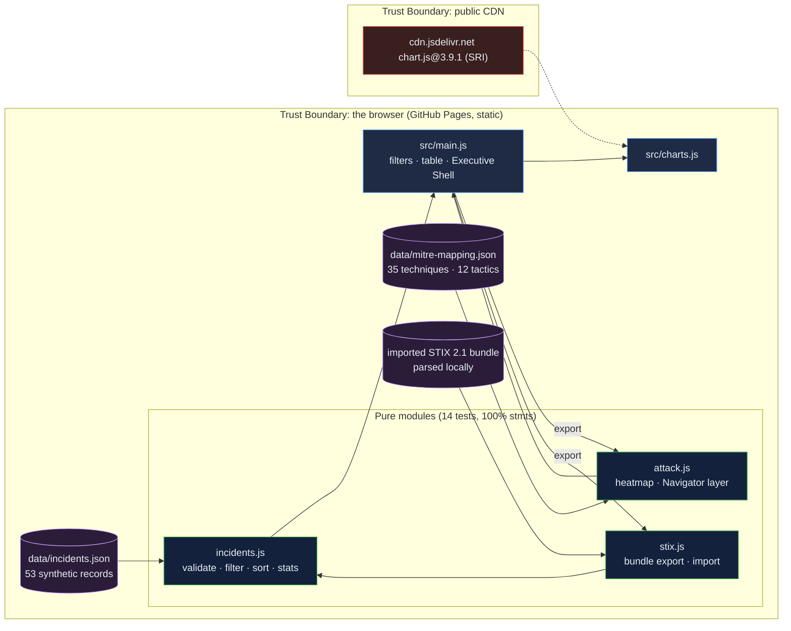

# Cybersecurity Incident Dashboard: incident records that add up, an ATT&CK heatmap, and STIX 2.1 in and out

[](https://github.com/Freddricklogan/cybersecurity-incident-dashboard/actions/workflows/deploy.yml)
[](#5-getting-started--verification)
[](https://github.com/Freddricklogan/cybersecurity-incident-dashboard/actions/workflows/codeql.yml)
[](LICENSE)
[](https://freddricklogan.github.io/cybersecurity-incident-dashboard/)

## 1. Executive Summary & Business Impact

**Problem statement.** Security dashboards are judged by how they look on
a wall, so they acquire status lights and clocks and lose the discipline
that makes a number defensible. The previous version of this page showed
"System Active" beside 53 static records, drew High and Medium in the same
colour, skipped quiet months from its timeline, sorted severity
alphabetically, and could exchange nothing with the tools an incident
team actually uses (`AUDIT.md`).

**Solution & value delivered.** A dashboard over a year of synthetic
incident records that computes what it shows — counts by severity, status
and attack type, unresolved backlog, median response time overall and by
severity, a filled monthly series — renders a MITRE ATT&CK technique
heatmap grouped by tactic, and speaks the two formats a SOC exchanges:
an ATT&CK Navigator layer (format 4.5, scored by incident count) and a
STIX 2.1 bundle of incident, attack-pattern and relationship objects,
which it can also import. Every record and every technique is validated;
a test round-trips all 53 records through STIX.

**[→ Read the full case study](docs/CASE_STUDY.md)**

| Outcome | How this repo delivers it |
| --- | --- |
| Numbers you can defend | `stats()` and `monthlySeries()` tested against hand values; the median response by severity is on the page |
| ATT&CK you can carry out of the page | `navigatorLayer()` produces a layer-format 4.5 document checked field by field in tests |
| Interchange both ways | `toStixBundle()` / `fromStixBundle()` with a round-trip test; import parses in the browser |
| No theatre | No status light, no clock; the page says the data are synthetic |
| Safe with user files | Every cell built with `textContent`; records validated with every problem named |

## 2. Demonstrated Competencies & Technical Skills

- **Cybersecurity & Compliance** — MITRE ATT&CK tactic/technique
  modelling, Navigator layer format, STIX 2.1 SDOs and relationships with
  external references, strict CSP, SRI, CodeQL and Trivy in CI.
- **Data Science & AI** — validated ingestion with rejection reporting,
  rank-ordered sorting, medians, filled time series, heat intensity.
- **Systems Architecture & CS** — pure modules with 100% statement
  coverage, a DOM layer without `innerHTML`, deterministic STIX ids.
- **EdTech & Human-Centered Design** — the tour starts by saying what the
  numbers are not; keyboard-focusable heatmap tiles carry the full
  technique description.

## 3. System Architecture & Data Flow



No backend, no account, no telemetry. An imported bundle never leaves the browser.

## 4. Technical Highlights & Engineering Decisions

### ADR-1 — Remove the status light before adding anything

**Context.** "System Active" and a live clock implied monitoring of 53
static records.

**Decision.** Both removed; the shell tagline, a badge and the footer
state that the data are synthetic and nothing is live. The KPI strip
shows counts and a median.

**Consequence.** A reviewer cannot mistake the demo for a product, and
every number on the page is one the code computed.

### ADR-2 — Interchange in the formats a SOC uses, with a round-trip test

**Context.** The blueprint asked for STIX 2.1 import and a Navigator layer
export. Severity and status have no core STIX property.

**Decision.** Incidents export as STIX 2.1 `incident` SDOs with `labels`
(`severity:high`) and `x_` extension properties, linked by `uses` to
`attack-pattern` SDOs carrying MITRE external references; the importer
accepts either the labels or the extensions. The Navigator layer scores
each technique by incident count.

**Consequence.** `tests/stix.test.js` round-trips all 53 records and
`tests/attack.test.js` checks the layer's version, domain, scores and
sub-technique flags, so both formats are guarded, not assumed.

### ADR-3 — Report what the mapping does not cover

**Context.** The old heatmap silently dropped techniques absent from the
mapping.

**Decision.** `heatmap()` returns an `unmapped` list and the page prints
it; a test asserts the shipped data has none.

**Consequence.** A new technique in imported data shows up as a named gap
rather than vanishing.

## 5. Getting Started & Verification

**Prerequisites.** Node 22 LTS. No build step; the page is served from the
repository root.

```bash
git clone https://github.com/Freddricklogan/cybersecurity-incident-dashboard.git
cd cybersecurity-incident-dashboard
npm ci
npm run lint && npm run validate && npm run coverage
npx serve .    # open http://localhost:3000
```

**Verification — the numbers this repository actually produced:**

```bash
npm run coverage   # 14 passed / 14; All files 100% stmts, 92.54% branches
npm run lint       # 0 problems
npm run validate   # html-validate index.html: clean
```

| Check | Result |
| --- | --- |
| Unit tests (Vitest) | **14 passed / 14** across 3 files |
| Coverage (pure modules) | **100%** statements, **92.54%** branches (`main.js`, `ui.js`, `charts.js` covered by the browser smoke test) |
| ESLint, html-validate | clean |
| Data integrity | 53 records, none rejected; every technique in the 35-technique mapping with matching tactic |
| Headless Chrome smoke | **0 console errors**; 53 shown, 15 critical, 9 unresolved, median response 2.2 h (Critical 2.5 · High 2.8 · Medium 1.9 · Low 0.4); 35 heatmap tiles, hottest 7; severity sort puts Critical first; Low filter → 50; Navigator layer 34 techniques scoring 50; STIX bundle 134 objects / 50 incidents; five tour steps; no horizontal scroll at 1280 or 400 px |

## 6. Live Demo & Production Showcase

**<https://freddricklogan.github.io/cybersecurity-incident-dashboard/>**

**30-second guided walkthrough.** Press **Take the 30-second tour**.

1. **The numbers are counts, not a status light.**
2. **Filter to the critical backlog** — charts, heatmap and table follow.
3. **ATT&CK heatmap** — techniques by tactic, shaded by count.
4. **Export a Navigator layer** — paste into the ATT&CK Navigator.
5. **Or a STIX 2.1 bundle** — and import it back.

Records are synthetic (`data/incidents.json`, 2025-03 to 2026-03). Technique names and descriptions in `data/mitre-mapping.json` follow MITRE ATT&CK®, which is © The MITRE Corporation and used under its terms.
